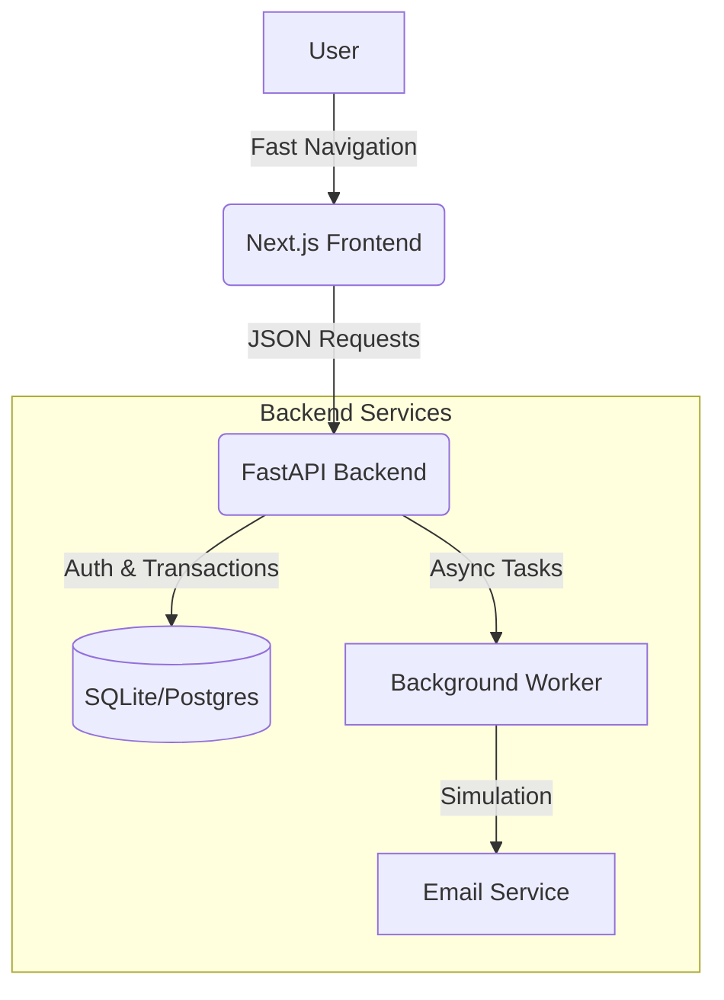

# ⚡ Neon Merch — Headless E-commerce

> A high-performance Fullstack e-commerce platform focused on instant user experience and data integrity.

## 📸 About the Project

**Neon Merch** is a "Headless" e-commerce (Frontend decoupled from Backend) built to solve common online store bottlenecks: slow loading times and stock inconsistencies.

The project uses **Next.js (SSG)** to generate an ultra-fast static storefront and **FastAPI** to manage complex checkout transactions with security and concurrency control.

### 🚀 Technical Highlights

* **Atomic Stock Control:** Implementation of database transactions (ACID) during checkout. This prevents race conditions (overselling) when two users try to buy the last item simultaneously.
* **Background Processing:** Confirmation emails are sent via `BackgroundTasks` (Workers), ensuring the UI doesn't freeze while the server processes heavy tasks.
* **JWT Authentication:** Secure and *stateless* login system for the administrative area.
* **Optimized Frontend:** Use of *Static Site Generation* (SSG) for SEO and performance, with intelligent cache revalidation.
* **Modern UX:** Instant visual feedback (Optimistic UI), "Toast" notifications, and visual effects (Confetti) for engagement.

## 🛠️ Tech Stack

**Backend:**
* Python 3.11
* **FastAPI** (High-performance REST API)
* **SQLModel** (ORM + Pydantic)
* SQLite (Dev) / PostgreSQL (Prod)
* Python-Jose (JWT Auth)

**Frontend:**
* **Next.js 14** (React Framework)
* Tailwind CSS (Neon/Dark Mode Styling)
* Zustand (Global State Management/Cart)
* Lucide React (Icons)
* Sonner (Notifications)

## 🏗️ Architecture

## ⚙️ How to Run Locally
Follow these instructions to run the project on your machine.

Prerequisites
Python 3.10+

Node.js 18+

1. Setting up the Backend (API)
Open your terminal in the root folder and execute:

## Bash

cd backend

## 1. Create virtual environment
python -m venv .venv

## 2. Activate environment
 * On Windows:
.venv\Scripts\activate

 * On Mac/Linux:
 source .venv/bin/activate

## 3. Install dependencies
pip install -r requirements.txt

## 4. Start the server (Windows PowerShell command)
1. The variable USE_REDIS="0" disables external cache for local dev
$env:USE_REDIS="0"; uvicorn app.main:app --reload

 * The API will be running at: http://localhost:8000 Access documentation (Swagger) at: http://localhost:8000/docs

2. Setting up the Frontend (Store)
Open a new terminal in the root folder and execute:

## Bash

cd frontend

## 1. Install dependencies
npm install

## 2. Start development server
npm run dev
Access the store at: http://localhost:3000

🔒 Access Credentials (Demo)
To create products in the admin panel (/docs), use:

Username: admin

Password: neon123

Developed by Willian Cordeiro.